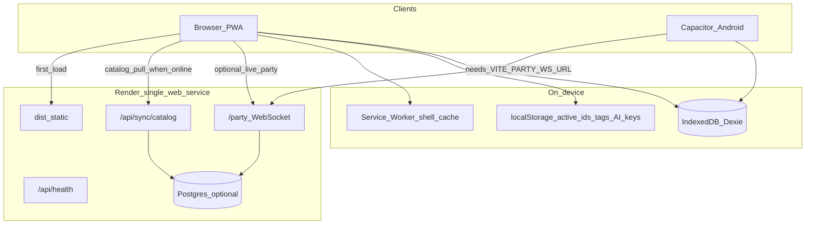

# Architecture — Con Floor Nav

## Purpose

Personal, offline-first convention floor navigator: import a floor map and booths, track vendors (status, tags, photos), drop a “you are here” pin, and pathfind along aisles. Optional live peer pins over WebSocket when Wi‑Fi works.

## High-level

## Stack

| Layer | Choice |
|-------|--------|
| App | Vite 8, React 19, TypeScript |
| Storage | Dexie 4 / IndexedDB (runtime) + optional Render Postgres (shared catalog + durable parties) |
| Map UI | CSS transform pan/zoom + SVG booth overlays (`MapViewer`) |
| Pathfinding | Grid A* around booths + obstacles (`src/lib/pathfinding.ts`) |
| PWA | `vite-plugin-pwa` |
| Native | Capacitor 8 Android (`app.confloornav.pwa`) |
| Party + hosting | `server/party-server.ts` serves `dist/` + `ws` path `/party` + `/api/sync/*` |

## Cloud sync

- **Source of truth (shared):** events, floor maps, booths, dealer names/tags via `GET /api/sync/catalog`.
- **Device-local:** visitStatus, notes, photos, pin, custom tags, AI keys.
- Client: `src/lib/cloudSync.ts` pulls on launch + `online`; Settings → Sync now.
- Postgres (`DATABASE_URL`) stores catalog bundle + party rooms (36h TTL). Without it, catalog is served from `public/samples` and parties are memory-only.

## Data model (Dexie)

Schema upgrades in `src/db/schema.ts` (v1 → v4).

| Table | Role |
|-------|------|
| `events` | Con weekend (name, venueNotes) |
| `floorMaps` | Image blob, size, name, obstacles, calibration; many per event |
| `booths` | `boothKey`, rect (normalized 0–1), `floorMapId`, label |
| `vendors` | Per booth: name, tags[], visitStatus, notes |
| `itemPhotos` | Blob + optional note → vendor |
| `userLocations` | Manual/GPS pin in map space (one logical pin per event) |

**Multi-map:** booths attach to `floorMapId`. Same `boothKey` may exist on different maps. Active event/map ids are in `localStorage`.

**Custom tags:** catalog in `localStorage` (`cfn-custom-tags`) plus defaults in `DEFAULT_TAGS`. Vendor rows store the selected tag strings.

**Backup:** format `cfn-backup`, version **2** (`floorMaps[]`, booth/vendor `mapKey`). Version 1 still restores.

## App structure

| Tab | Role |
|-----|------|
| Map | Floor viewer, filters, My pin, details panel |
| Go | Favorites quick-pick, Share pin, Live party |
| Photos | Gallery by vendor |
| Settings | Events, Floor maps, Customize, Backup, Native, Import |
| AI | Optional cloud extract + prompt helper |

## Import paths

All produce the same booth JSON shape (see `src/lib/import.ts` / `BoothImportJson`):

1. Settings → Import: map image + JSON/CSV
2. Sample: Otakon 2026 Dealers (`src/lib/sampleData.ts`)
3. External AI: copy prompt (`src/lib/aiPrompt.ts`) → paste JSON
4. In-app AI tab: OpenAI/Claude with local keys → review → save

Map image modes: replace active map, add map, or replace-all (sample).

## Networking

| Feature | Network |
|---------|---------|
| Map, vendors, photos, aisle nav, share-link paste | Offline after first cache |
| Live party | `wss://<host>/party` (Render same-origin in production builds) |
| In-app AI extract | Online + user API keys |

Dev Vite: Live party UI off unless `VITE_PARTY_WS_URL` is set. Capacitor WebView uses `https://localhost` — set `VITE_PARTY_WS_URL` to the Render `wss://…/party` URL at **build** time for Live party.

## Deploy

- Blueprint: `render.yaml`
- Branch currently auto-deployed: `cursor/phase2-3-backup`
- Live: https://con-floor-nav.onrender.com
- One service only — no separate party instance required
- Free tier may cold-start (~30s)

## Security / privacy notes

- All personal con data stays on device unless the user exports a backup or joins a party.
- Party codes are shared intentionally; do not post publicly.
- AI keys never leave the device except to the chosen provider API.
